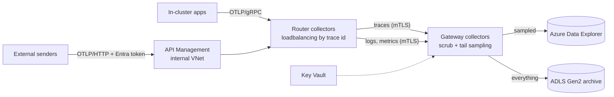

# otel-azure-pipeline

An OpenTelemetry pipeline on Azure where nothing is public and nothing holds a secret.
Apps send OTLP, a two-tier Collector on AKS scrubs and tail-samples it, and it lands in
Azure Data Explorer for querying and ADLS Gen2 for the long-term archive.

Companion to [telemetry-scrubber](https://github.com/siva-maruri/telemetry-scrubber),
which handles the entropy checks and tokenization the Collector can't do on its own.



## What's here

| Path | What it is |
|---|---|
| `infra/` | Bicep for the VNet, private DNS, private AKS, ADX, ADLS Gen2, Key Vault, APIM, Log Analytics |
| `collector/` | Helm values for the router and gateway tiers (open-telemetry/opentelemetry-collector chart), cert-manager certificates for mTLS between them |
| `adx/` | Table definitions, retention and caching policies, and on-call query functions |
| `alerts/` | Prometheus alert rules on the collectors' own metrics, with promtool unit tests |
| `apim/` | Inbound policy for the OTLP API: JWT validation, per-caller limits, payload cap |
| `scripts/` | `deploy.sh`, `validate.sh`, `local_test.sh`, `send_test_span.sh` |
| `docs/adr/` | Why it's built this way: two tiers, ADX over Log Analytics, no Event Hubs yet, no secrets, scrub at the source, mTLS with cert-manager |
| `docs/runbook.md` | What to check when traces stop arriving, the gateway backs up, or APIM rejects senders |

## Deploy

```bash
az login
bash scripts/deploy.sh rg-otel-pipeline westus2
```

Set `prefix`, `otlpAudience`, `apimPublisherEmail` and `alertEmail` in `infra/main.bicepparam` first. The
defaults use Dev SKUs for ADX and APIM to keep a demo cheap; `infra/prod.bicepparam` is the
same template with SLA-backed SKUs (`bash scripts/deploy.sh <rg> <region>` picks the dev file;
pass the prod file to `az deployment group create` directly for production).
The first run is slow, mostly APIM, which takes 30 to 45 minutes to come up inside a VNet.
The AKS API server is private, so the script installs the collectors with
`az aks command invoke` instead of a local kubectl.

External senders need an app registration exposing the `otlpAudience` URI with a
`Telemetry.Write` app role. Assign that role to each sending app or managed identity.

## Design notes

**Two collector tiers.** Tail sampling only works if every span of a trace reaches the
same collector. The router tier hashes trace ids across the gateway pods (through a headless
service), so the gateway can scale out without splitting traces. Logs and metrics skip that
and go round-robin.

**Archive before sampling.** The gateway runs two trace pipelines off the same receiver.
One tail-samples into ADX (every error, every trace over 1.5s, 10% of the rest). The other
writes every scrubbed span to ADLS Gen2, which ages to cool at 30 days, archive at 180,
and deletes at 365. Investigations that need the unsampled data can replay it from there.

**No secrets.** The gateway runs as a user-assigned managed identity through AKS workload
identity: a federated credential trusts the cluster's OIDC issuer for the `otel-gateway`
service account. The identity has Ingestor on the ADX database, Blob Data Contributor on
the archive account and Secrets User on Key Vault, nothing else. Storage has shared key
access turned off.

**Nothing public.** AKS is a private cluster. ADX, storage and Key Vault have public network
access disabled and are reached over private endpoints. APIM runs in internal mode, so even
the OTLP front door is only reachable from inside the network. It still needs a public IP
for its management plane; that's a platform requirement for stv2 VNet injection.

**The pipeline watches itself.** Both collector tiers expose their internal metrics, Azure
Monitor managed Prometheus scrapes them, and five alerts cover the ways this pipeline
actually fails: no collector reporting, no spans arriving, an exporter queue filling, an
exporter dropping spans, and receivers refusing data under memory pressure. The rules live in
`alerts/collector-rules.yaml`, are unit-tested with promtool against synthetic healthy and
failing series, and Bicep deploys that same file, so what's tested is what runs. Each alert
links to its runbook section.

**Autoscaling, with a slow scale-down on the gateway.** Both tiers scale on CPU (gateway 3 to
12 pods, router 2 to 8), and the node pool autoscales underneath them. The gateway scales down
one pod at a time after 15 quiet minutes, because every change reshuffles which gateway owns
which trace (ADR 1) and traces in flight are sampled on partial data. The router is stateless
and scales freely.

**Mutual TLS between the tiers.** cert-manager runs a private CA in the namespace and issues
a server certificate to the gateway and a client certificate to the router, rotating both
before they expire. The gateway has no plaintext listener and rejects clients without a
certificate from that CA. The router dials gateway pod IPs, so it verifies the certificate
against the headless service name (`server_name_override`). See ADR 6.

**OTLP/gRPC stays inside.** APIM fronts OTLP/HTTP only. Its gRPC support is limited to the
self-hosted gateway, and in-cluster senders don't need it anyway.

**Audit.** Key Vault, storage, ADX and APIM send their audit logs to one Log Analytics
workspace, so "who read what" is answerable in one place.

**Credentials are dropped twice.** APIM strips the caller's `Authorization` header before
forwarding, and the gateway deletes any captured auth, cookie or API key headers. Card
numbers and AWS keys are masked by the `redaction` processor, SAS signatures by OTTL.

## Checks

`scripts/validate.sh` builds and lints the Bicep, checks the APIM policy is well-formed,
renders both Helm releases and validates the resulting Collector configs with the same
otelcol-contrib version the pods run (0.161.0), then checks the alert rules and runs their
promtool unit tests. The alert tests are themselves checked: loosening the exporter-failure
threshold makes them fail.

`scripts/local_test.sh` goes further: it runs the rendered router and gateway configs
locally over mTLS with test certificates and debug exporters in place of ADX and blob storage.
It checks that the gateway refuses plaintext and certificate-less clients, then sends 32 spans
and checks that errors and slow traces survive sampling, all 32 reach the archive pipeline,
and the auth header and SAS signature are gone. CI runs both.

## Known gaps

- Traffic into the router (from APIM over the internal load balancer, and from in-cluster
  apps) is unencrypted. It never leaves the VNet, APIM has already checked the caller's token,
  and services scrub before sending (ADR 5), but it isn't TLS. Closing it properly means
  moving the CA into Key Vault so APIM can trust it for backend validation, since cert-manager's
  in-cluster CA doesn't exist yet when the Bicep deployment runs.
- Collector metrics reach Azure Monitor through its public ingestion endpoints (over the
  Microsoft network, authenticated, but not a private endpoint). Keeping that private needs
  an Azure Monitor Private Link Scope, which isn't set up here.
- Never deployed to a live subscription. Everything above is validated offline: templates
  build and lint, collector configs pass the official validator, and the local test runs the
  real configs. A first real deployment will likely need small fixes.

Left out on purpose, with the reasoning in the ADRs: Event Hubs in front of ADX (ADR 3), and
entropy checks and tokenization in the Collector itself (ADR 5, they happen in the SDK).
