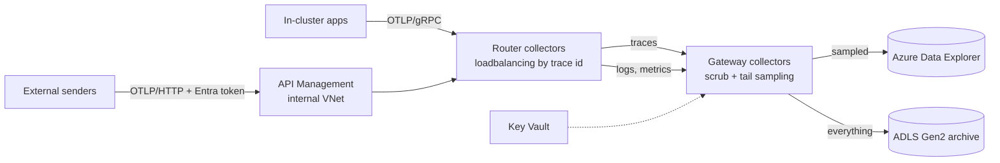

# otel-azure-pipeline

An OpenTelemetry pipeline on Azure where nothing is public and nothing holds a secret.
Apps send OTLP, a two-tier Collector on AKS scrubs and tail-samples it, and it lands in
Azure Data Explorer for querying and ADLS Gen2 for the long-term archive.

Companion to [telemetry-scrubber](https://github.com/siva8537853-blip/telemetry-scrubber),
which handles the entropy checks and tokenization the Collector can't do on its own.



## What's here

| Path | What it is |
|---|---|
| `infra/` | Bicep for the VNet, private DNS, private AKS, ADX, ADLS Gen2, Key Vault, APIM, Log Analytics |
| `collector/` | Helm values for the router and gateway tiers (open-telemetry/opentelemetry-collector chart) |
| `adx/` | Table definitions, retention and caching policies, and on-call query functions |
| `apim/` | Inbound policy for the OTLP API: JWT validation, per-caller limits, payload cap |
| `scripts/` | `deploy.sh`, `validate.sh`, `local_test.sh`, `send_test_span.sh` |

## Deploy

```bash
az login
bash scripts/deploy.sh rg-otel-pipeline westus2
```

Set `prefix`, `otlpAudience` and `apimPublisherEmail` in `infra/main.bicepparam` first.
The first run is slow, mostly APIM, which takes 30 to 45 minutes to come up inside a VNet.
The AKS API server is private, so the script installs the collectors with
`az aks command invoke` instead of a local kubectl.

External senders need an app registration exposing the `otlpAudience` URI with a
`Telemetry.Write` app role. Assign that role to each sending app or managed identity.

## Design notes

**Two collector tiers.** Tail sampling only works if every span of a trace reaches the
same collector. The router tier hashes trace ids across the gateway pods (through a headless
service), so the gateway can scale out without splitting traces. Logs and metrics skip that
and go round-robin.

**Archive before sampling.** The gateway runs two trace pipelines off the same receiver.
One tail-samples into ADX (every error, every trace over 1.5s, 10% of the rest). The other
writes every scrubbed span to ADLS Gen2, which ages to cool at 30 days, archive at 180,
and deletes at 365. Investigations that need the unsampled data can replay it from there.

**No secrets.** The gateway runs as a user-assigned managed identity through AKS workload
identity: a federated credential trusts the cluster's OIDC issuer for the `otel-gateway`
service account. The identity has Ingestor on the ADX database, Blob Data Contributor on
the archive account and Secrets User on Key Vault, nothing else. Storage has shared key
access turned off.

**Nothing public.** AKS is a private cluster. ADX, storage and Key Vault have public network
access disabled and are reached over private endpoints. APIM runs in internal mode, so even
the OTLP front door is only reachable from inside the network. It still needs a public IP
for its management plane; that's a platform requirement for stv2 VNet injection.

**OTLP/gRPC stays inside.** APIM fronts OTLP/HTTP only. Its gRPC support is limited to the
self-hosted gateway, and in-cluster senders don't need it anyway.

**Audit.** Key Vault, storage, ADX and APIM send their audit logs to one Log Analytics
workspace, so "who read what" is answerable in one place.

**Credentials are dropped twice.** APIM strips the caller's `Authorization` header before
forwarding, and the gateway deletes any captured auth, cookie or API key headers. Card
numbers and AWS keys are masked by the `redaction` processor, SAS signatures by OTTL.

## Checks

`scripts/validate.sh` builds and lints the Bicep, checks the APIM policy is well-formed,
renders both Helm releases and validates the resulting Collector configs with the same
otelcol-contrib version the pods run (0.161.0).

`scripts/local_test.sh` goes further: it runs the rendered router and gateway configs
locally with debug exporters in place of ADX and blob storage, sends 32 spans, and checks
that errors and slow traces survive sampling, all 32 reach the archive pipeline, and the
auth header and SAS signature are gone. CI runs both.

## Known gaps

- The router to gateway hop is plaintext inside the cluster. mTLS would come from a service
  mesh, which is out of scope here.
- Dev SKUs for ADX and APIM keep a demo affordable but have no SLA.
- No Event Hubs between the gateway and ADX. Queued ingestion already absorbs bursts; add
  Event Hubs when you need replay from a stream or a second consumer.
- telemetry-scrubber isn't wired in yet. The plan is a sidecar on the gateway with its HMAC
  key in the Key Vault this deploys.
